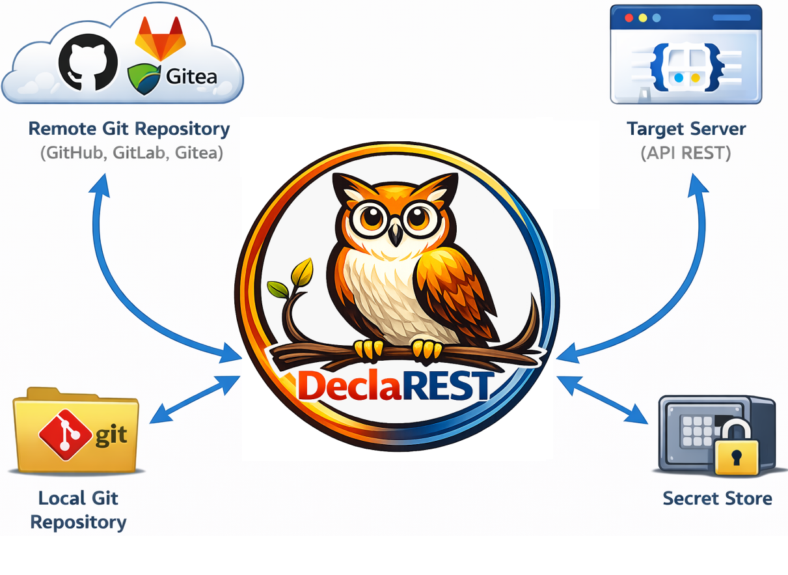

# DeclaREST

    

DeclaREST syncs resources between a Git-backed repository and a target server, letting teams manage its configuration state declaratively (*GitOps*) through its native REST APIs.

## What it solves

- Replace *ad-hoc* API scripts with versioned, reviewable files in Git.
- Detect drift between repository definitions and live systems.
- Promote changes safely across environments using named contexts.
- Keep secrets out of repository files while still templating them.

    

## How it works

1. *Resources* live in the repository (`/teams/platform/users/alice`) keeping the same structure used in *managed server* (`https://<hostname>/teams/platform/users/alice`).
2. You can pull a *resource* from the *REST API server* into *Git repository*: `declarest resource save --path /teams/platform/users/alice`.
3. You can update *resource* state in repository and push it back to the *API REST server*: `declarest resource apply --path /teams/platform/users/alice`.
4. If needed, you can verify state differences for a *resource* between the *Git repository* (*desired state*) and the *managed server* (*actual state*): `declarest resource diff --path /teams/platform/users/alice`.
5. *Metadata* can define how a *resource* maps to its REST API endpoint (useful when the target API drifts from REST conventions) and can also mark sensitive attributes as *secrets* so they’re stored and managed in a secure *secret store* (outside Git repo).
6. Need to issue a custom HTTP request or observe the server response without touching the repository? Use `declarest ad-hoc <method> <path>` to honor metadata headers/placeholders before hitting the target API.

## When to use DeclaREST

Use DeclaREST when you want a declarative workflow for REST-managed resources and need:

- Deterministic mapping between repo paths and API endpoints.
- Repeatable reconciliation that you can automate or review.
- Handle REST API services with GitOps the same way you manage your infrastructure.

## Quick links

- [Getting started](getting-started/quickstart.md)
- [Concepts](concepts/overview.md)
- [Configuration reference](reference/configuration.md)
- [Contributing and development](contributing.md)

## Workflows

- [Repository operations](workflows/repository.md)
- [Sync resources](workflows/sync.md)
- [Ad-hoc requests](workflows/ad-hoc.md)
- [Editing contexts & metadata](workflows/editing.md)
