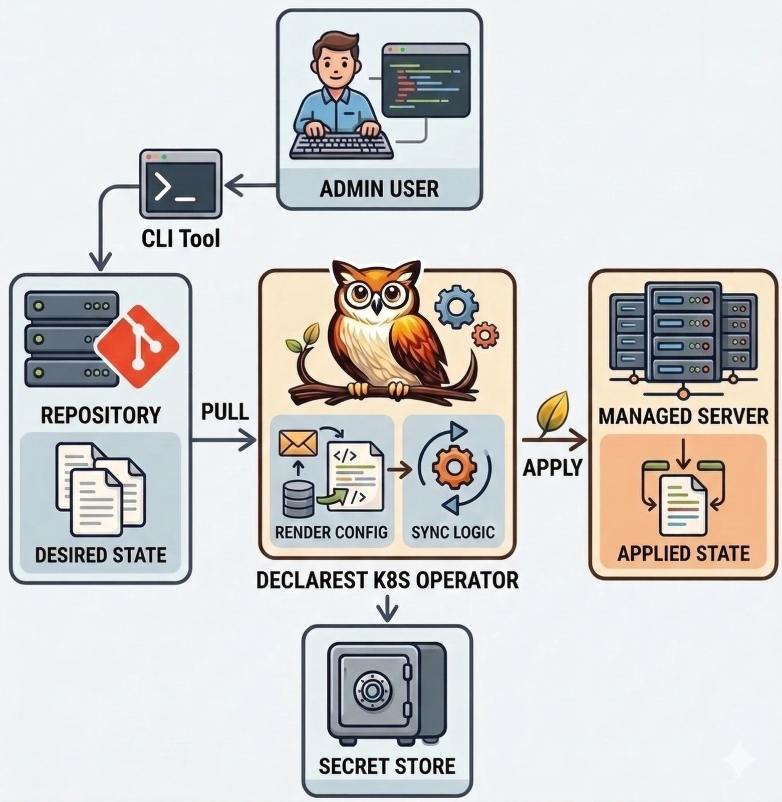

# DeclaREST

<p align="center">
  
</p>

DeclaREST enables declarative management of REST API–backed systems, using a Git repository as the *Source of Truth* (SoT) for desired state and following GitOps principles.

You can use it as a CLI for on-demand runs or CI/CD workflows, or as a Kubernetes Operator that continuously reconciles managed servers to match what’s defined in your Git repository.

## What this project solves

Teams usually manage system's configuration through scripts, manual UI steps, and low-visibility changes.

DeclaREST standardizes this into:

- Stable logical paths (`/corporations/acme`, `/admin/realms/prod/clients/app`)
- Repository-managed desired state
- Repeatable `save -> diff -> apply` workflows
- Metadata-driven adaptation for APIs that are not clean REST
- Secret placeholders instead of plaintext in resource files

If you’re used to GitOps workflows, DeclaREST will feel natural: define desired state in Git and keep systems in sync.

## Usage flow

<p align="center">
  
</p>

## Interacting with APIs through DeclaREST CLI

```bash
declarest resource save /corporations/acme # get a resource from managed server
declarest resource edit /corporations/acme # get a resource definition in the git repository
declarest resource diff /corporations/acme # see state difference from git repository and remote managed server
declarest resource apply /corporations/acme # apply new desired state to managed server
```

## Using Kubernetes Operator

Use the quickstart to install CRDs, create `ResourceRepository`, `ManagedServer`, `SecretStore`, and `SyncPolicy`, then verify reconciliation:

- [Quickstart (Operator - recommended)](start-here/quickstart-operator.md)

## Capabilities snapshot

- **Resource workflows:** read/list/save/diff/explain/apply/create/update/delete/edit/copy
- **Metadata workflows:** infer/render/set/resolve overrides for custom API shapes
- **Secret workflows:** detect/store/mask/resolve with save-time safeguards
- **Repository workflows:** status/tree/history/commit/refresh/push/reset/clean
- **Kubernetes operator workflows:** multi-CRD reconciliation (`ResourceRepository`, `ManagedServer`, `SecretStore`, `SyncPolicy`)

## When it fits

Use DeclaREST when you need:

- Git review and history for API configuration
- repeatable automation across environments
- one model for both local debugging and continuous sync
- support for APIs that need mapping logic

## When it may not fit

DeclaREST is usually not the best fit when:

- resource state changes are highly ephemeral and not worth storing in Git
- your workflow requires direct imperative-only changes with no desired-state source

## Start here

- [What is DeclaREST?](start-here/what-is.md)
- [GitOps model (CLI vs Operator)](start-here/gitops-model.md)
- [Install](getting-started/installation.md)
- [Quickstart (CLI)](getting-started/quickstart.md)
- [Quickstart (Operator - recommended)](start-here/quickstart-operator.md)
- [Troubleshooting](start-here/troubleshooting.md)

## For advanced API modeling

When your API uses inconsistent paths, mixed collections, or per-operation payload quirks:

- [Metadata overview](concepts/metadata.md)
- [Metadata Overrides](concepts/metadata-overrides.md)
- [Custom Paths](concepts/metadata-custom-paths.md)
- [Advanced Metadata Configuration](workflows/advanced-metadata-configuration.md)
