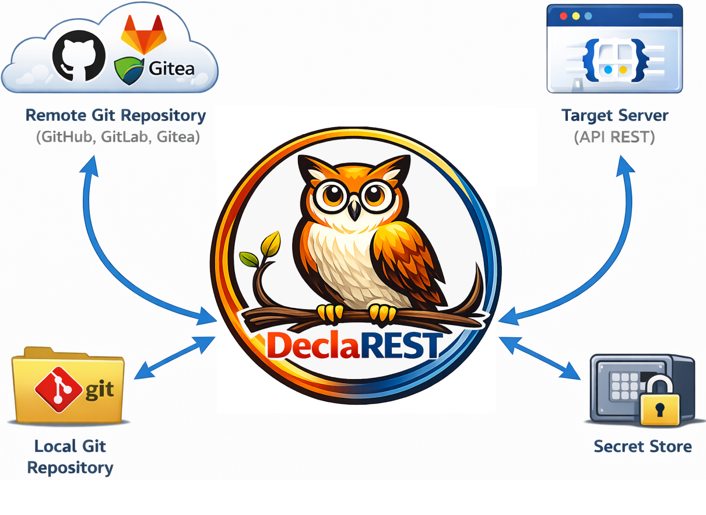

# DeclaREST

<p align="center">
  
</p>

DeclaREST gives REST APIs a GitOps-style workflow: store resources as files, review with Git, and sync with a deterministic CLI.

## What this project solves

Teams usually manage REST-backed configuration through scripts, manual UI steps, and low-visibility changes.

DeclaREST standardizes this into:

- stable logical paths (`/corporations/acme`, `/admin/realms/prod/clients/app`)
- repository-managed desired state (`resource.json|yaml`)
- repeatable `save -> diff -> apply` workflows
- metadata-driven adaptation for APIs that are not clean REST
- secret placeholders instead of plaintext in resource files

## Architecture at a glance



## Happy path (first 2 minutes)

```bash
declarest config add

declarest resource save /corporations/acme
# edit <repo>/corporations/acme/resource.json

declarest resource diff /corporations/acme
declarest resource apply /corporations/acme
```

## Capabilities snapshot

- Resource workflows: read/list/save/diff/explain/apply/create/update/delete/edit/copy
- Raw requests: `declarest resource request <method> ...`
- Metadata workflows: infer/render/set/resolve overrides for custom API shapes
- Secret workflows: detect/store/mask/resolve with save-time safeguards
- Repository workflows: status/tree/history/commit/refresh/push/reset/clean

## Start here

- [Installation](getting-started/installation.md)
- [Quickstart](getting-started/quickstart.md)
- [Concepts overview](concepts/overview.md)
- [CLI reference](reference/cli.md)

## For advanced API modeling

When your API uses inconsistent paths, mixed collections, or per-operation payload quirks:

- [Metadata overview](concepts/metadata.md)
- [Metadata Overrides](concepts/metadata-overrides.md)
- [Custom Paths](concepts/metadata-custom-paths.md)
- [Advanced Metadata Configuration](workflows/advanced-metadata-configuration.md)
